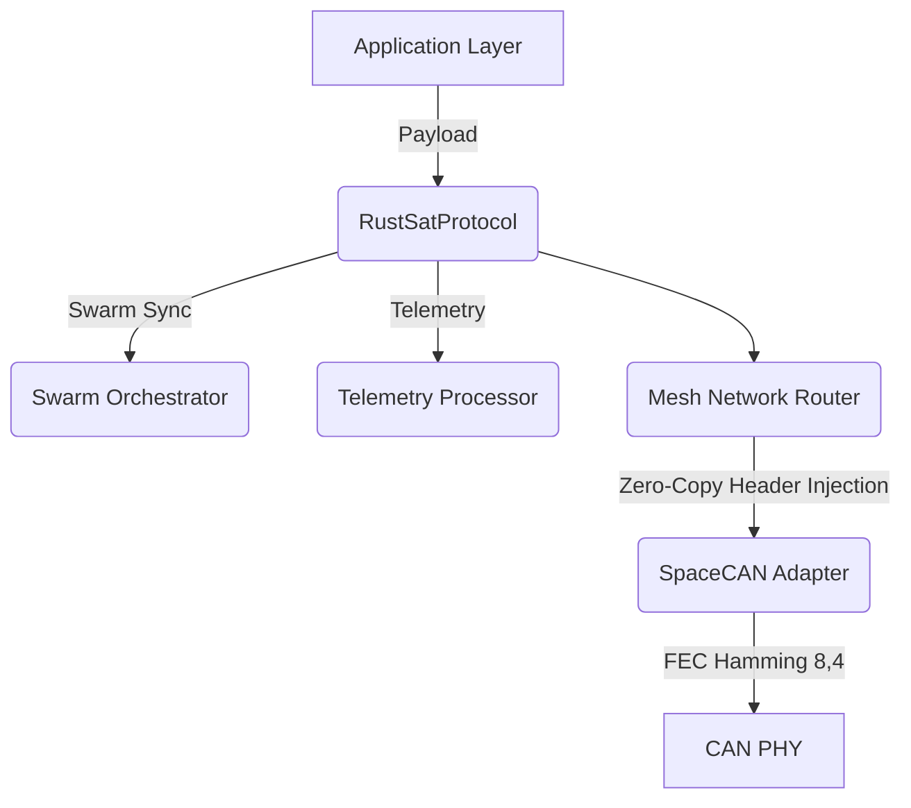

# RustSat-ESA 🛰️


SpaceCAN-compatible CubeSat communication protocol stack designed for European Space Agency (ESA) missions.

This is a `#![no_std]` strictly `alloc`-free Rust library tailored for bare-metal ARM Cortex-M microcontrollers operating in High-Radiation environments. It features Zero-Copy Mesh Routing, O(1) Telemetry Ring Buffers, and Typestate-based Swarm Synchronization.

## Architecture



## Features

- **Zero-Copy Mesh Routing**: `NetworkHeaderView` modifies packet headers directly inside the physical layer buffer, avoiding heavy memory operations.
- **Typestate Swarm Sync**: Compile-time guarantees that critical operations (like orbit maneuvers) cannot execute unless the satellite is synchronized with the swarm.
- **Lock-Free Metrics**: Real-time performance telemetry using `AtomicU32` with `SeqCst` ordering to prevent priority inversion on RTOS.
- **O(1) Circular Telemetry**: Uses `heapless::Deque` for lightning-fast memory-safe sensor data logging.
- **Formal Verification Ready**: No `unsafe` blocks. `#![deny(unsafe_code)]` enabled.

## Cargo Features
| Feature | Default | Description |
|---|---|---|
| `defmt` | Yes | Enables `defmt` structured logging for embedded targets. |
| `simulation` | No | Enables the `SimulationConfig` struct for host-side Monte Carlo simulations. |

## Quickstart

Add this to your `Cargo.toml`:
```toml
[dependencies]
rustsat-esa = "0.1.0"
```

### Usage Example
```rust
use rustsat_esa::RustSatProtocol;

fn main() {
    // Initialize the protocol stack with a local node ID
    let mut sat = RustSatProtocol::new(42);
    sat.initialize().unwrap();

    // Send a message to Node 15
    let payload = b"Hello Earth";
    match sat.send_message(15, payload) {
        Ok(_) => defmt::info!("Transmission successful!"),
        Err(e) => defmt::error!("Failed to transmit: {}", e),
    }
}
```

### QEMU Testing
To run the integration tests on an emulated Cortex-M3:
```bash
cargo run --example qemu_test --target thumbv7m-none-eabi
```

## License
Licensed under the MIT License. Copyright (c) 2026 s7g4.
